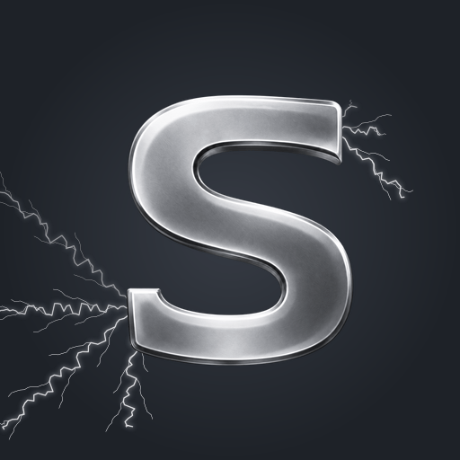

# Discord artwork

Stationary silver S with white lightning emerging from behind its two open
terminals, using the editor's graphite palette. The built-in image generation
tool produced the transparent S; only the separate lightning layer moves.



| File | Purpose |
| --- | --- |
| `sideralLightning.gif` | Rich Presence animation: 512 × 512, 120 frames, 50 fps, 2.4-second infinite loop |
| `sideralLightning.png` | Static 1024 × 1024 export for the Developer Portal |
| `sideralMark.png` | Original transparent, stationary S foreground |
| `generationPrompt.txt` | Exact generation prompts and provenance |

The palette comes from `src/styles/base.css`: graphite `#282c34`, dark graphite
`#1e2228`, silver `#aeb4bd` and pale silver `#d0d3d8`. Both exports are
downsampled from the original cutout. Composition has three ordered layers:
graphite background, animated branching lightning, then the stationary S.
The generated matte's nearly opaque metal is made fully opaque before
composition, so the foreground covers the electricity, including its glow. Rays start
behind the upper-right and lower-left terminals and extend toward the image
edges. The letter has no morphing, camera motion, zoom or frame interpolation.

Motion is periodic, with a fixed 20 ms frame delay. The authoring script checks
that every fully opaque foreground pixel remains unchanged throughout the raw
animation and the decoded GIF, and that the loop's opening and closing images
match exactly.
GIF palette reuse and disabled dithering reduce noise in the stationary metal.

## Discord setup

The extension sets `assets.largeImage` to:

```text
https://raw.githubusercontent.com/BRUN0R2/sideral-editor/main/assets/discord/sideralLightning.gif
```

Publish these assets to `main` and make the repository public before expecting
Discord to show the image. The URL must return the GIF without authentication.
While the repository is private, no token or authenticated URL should be put
in the presence payload. The source configuration is in
`extensions/discord-presence/src/activity.ts`.

Build and install the updated Discord Work Presence extension, then run
**Discord: Refresh Discord Work Presence** in Sideral. The GIF is animated by
Discord and introduces no application animation timers or per-frame RPC calls.

For a static application icon, upload `sideralLightning.png` to the app's icon
field in the Discord Developer Portal. A Rich Presence art asset uploaded to
the portal is also static. Discord documents support for GIF animation through
[external asset URLs](https://docs.discord.com/developers/discord-social-sdk/development-guides/setting-rich-presence#uploading-assets).
The application icon and Rich Presence artwork are separate settings.

## Rebuild the exports

Use Node.js 24 or later and sharp 0.35.5 as an isolated authoring dependency;
neither the application nor the extension needs an image processing package.
From the repository root:

```powershell
npm install --prefix build/artworkTools --no-save --ignore-scripts sharp@0.35.5
node scripts/buildDiscordArtwork.mjs build/artworkTools/node_modules/sharp
```

The script keeps the transparent foreground unchanged and replaces the derived
GIF and PNG. Dimensions, frame count, duration and infinite looping are checked
after encoding. The `settings` and `lightning` objects contain framing, timing,
terminal anchors, ray directions and glow parameters.
